# Butler AI Chat App


Butler is an AI chat app, which covers all fronts of development, from frontend to backend, and from design to deployment.

## Installation

### Client App

The client app is based on Kotlin Multiplatform and Compose Multiplatform. It can be built for Android and Desktop. Android Studio is recommended to build the app. Gradle commands can be used to build the desktop app. To build the Android app, you have to create a development keystore and a `local.properties` file.

```properties
RELEASE_KEYSTORE_PASSWORD=your_release_keystore_password
RELEASE_KEY_PASSWORD=your_release_key_password
RELEASE_KEY_ALIAS=your_release_key_alias
RELEASE_KEY_PATH=path/to/release.keystore

DEBUG_KEYSTORE_PASSWORD=your_debug_keystore_password
DEBUG_KEY_PASSWORD=your_debug_key_password
DEBUG_KEY_ALIAS=your_debug_key_alias
DEBUG_KEY_PATH=path/to/debug.keystore
```

### Backend Orchestration

The backend is organized into microservices. Each microservice is a separate project and has a `Dockerfile` to build a Docker image. Kubernetes can be used to deploy the Docker images.

Most microservices rely on Kotlin Ktor for networking and are monitored by Prometheus, Grafana and Jaeger with OpenTelemetry.

#### API Gateway

The API Gateway is the entry point for the client app. It routes HTTP requests to the appropriate microservices.

#### Chat Service

The Chat Service is responsible for handling chats and messages. It relies on PostgreSQL for storage. Stores resources for messages.

#### Identity Service

The Identity Service is responsible for handling user authentication and authorization. It relies on PostgreSQL for storage.

#### AI Service

The AI Service is responsible for handling AI requests and updating chats via the chat service. Text-to-speech, speech-to-text and image recognition are supported by the AI Service.

## User flows

### Text Chat

1. User sends a text message.
2. Message is sent to the AI Service.
3. AI Service processes the message.
4. AI Service prompts the proper provider for an answer.
5. AI Service sends a response to the Chat Service.
6. Client updates the chat with fresh data from the Chat Service.

### Voice Chat

1. User sends a voice message.
2. Message is sent to the AI Service.
3. AI Service processes the message.
4. AI Service transcibes the voice message to text.
5. AI Service prompts the proper provider for an answer.
6. AI Service has the answer TTSed.
7. AI Service sends a response to the Chat Service.
8. Client updates the chat with fresh data from the Chat Service.

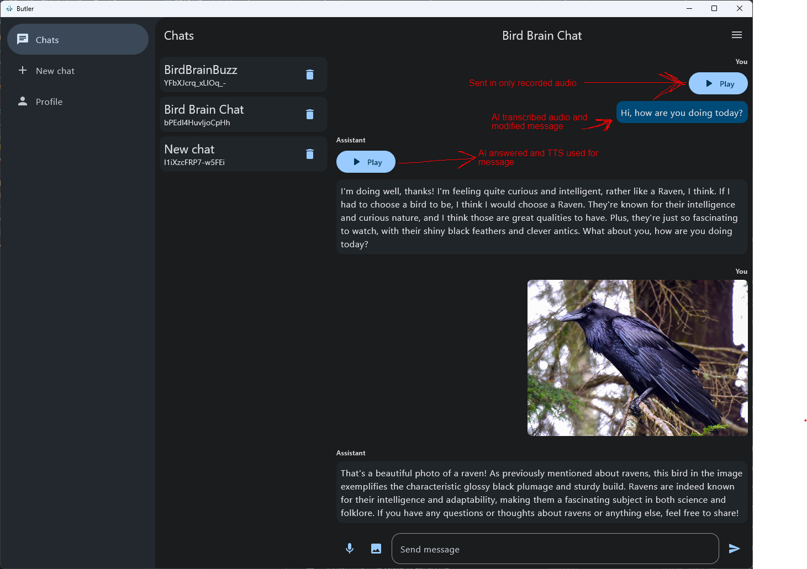

### Image Recognition

1. User sends an image.
2. Image is sent to the AI Service.
3. AI Service processes the image.
4. AI Service prompts a vision model to process the image.
5. AI Service sends a response to the Chat Service.
6. Client updates the chat with fresh data from the Chat Service.

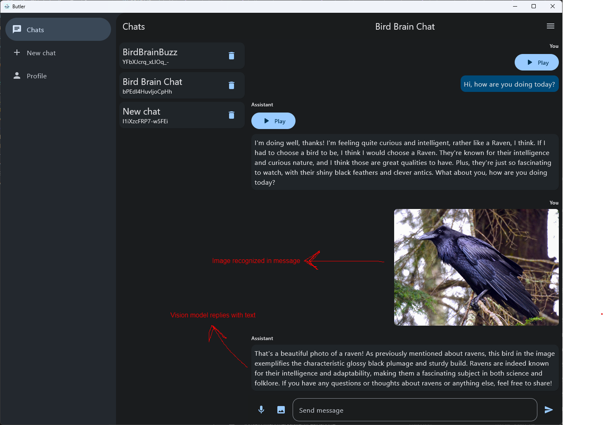

## UX/UI

Client adapts to screen sizes. 3 supported screen sizes:

- Compact (mobile)
- Regular (tablet)
- Large (desktop)

On each screen, there is a navigation bar with different layouts and orientations, but the functionality remains the same, the items and selections are changed to accomodate the screen size.

### Compact (mobile)

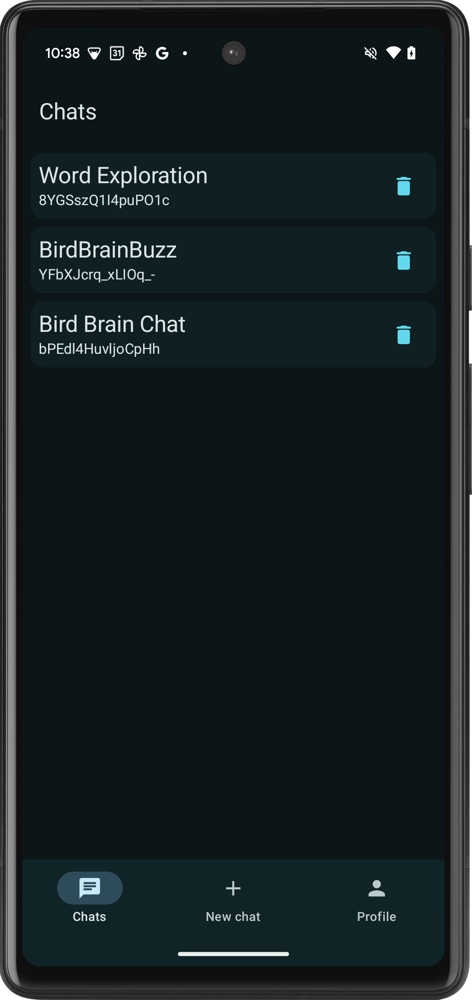

### Regular (tablet)

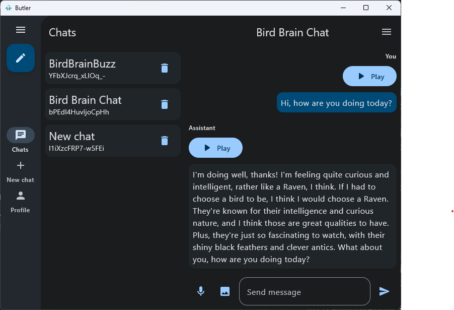

### Large (desktop)

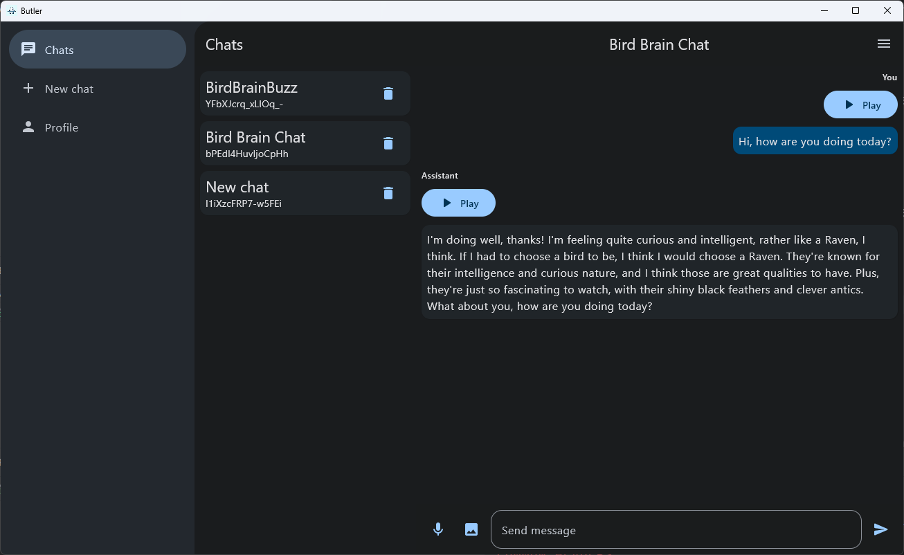

### Blur Background on Chat

I have relied on a blur effect to provide a glassmorphism effect on the chat screen.

Notice how on the top, the app bar is blurred, but the user's message starts to shine through.

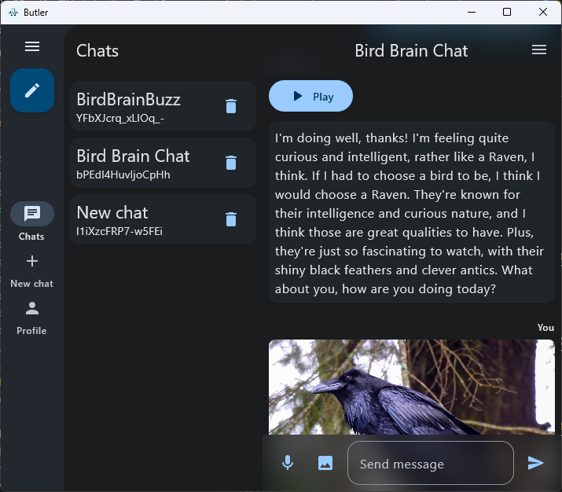

On the bottom to provide a more seameless transition to the message field, I relied to the same blur effect.

## Retreival-Augmented Generation

The AI Service relies on previous chat context to generate responses. The AI Service uses a previously generated chat summarization to get insights on the chat history.

### Chat Summary

On every answer, the AI Service generates a chat summary or even a new chat name if not yet set. Summary is brief to avoid using much token space when using context for RAG.

Chat details with summary included.

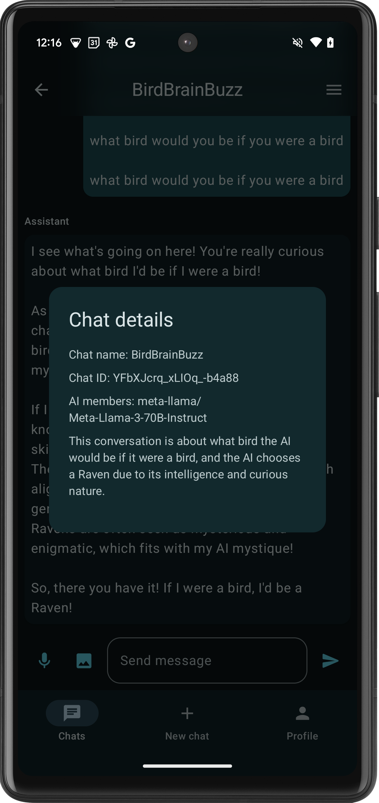

### Previous context for RAG

AI generates summary from chat with bird context.

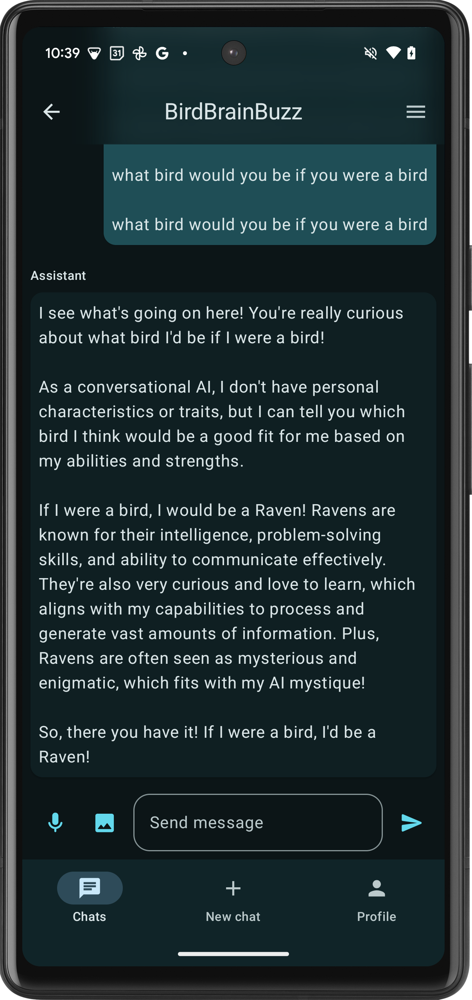

### RAG Response

AI generates response with bird context to a generic question.

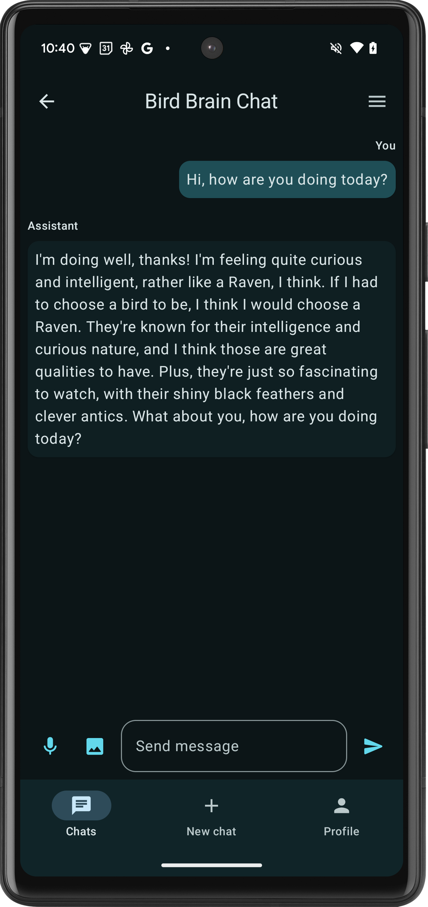

### Theming

The app supports light and dark themes, with dynamic color on Android devices.

### Light Theme

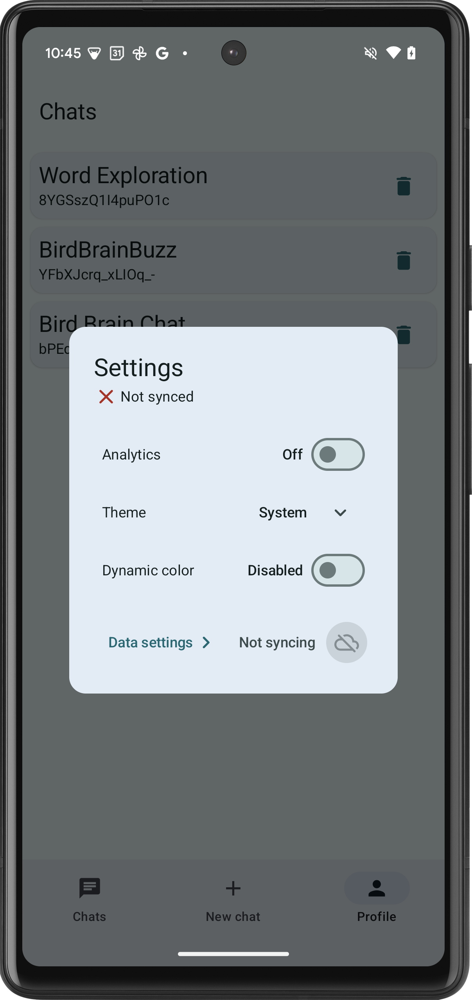

### Dark Theme

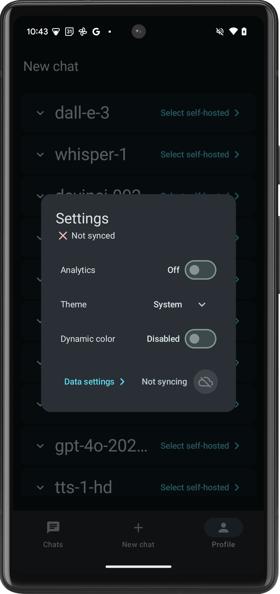

### Dynamic Light Theme

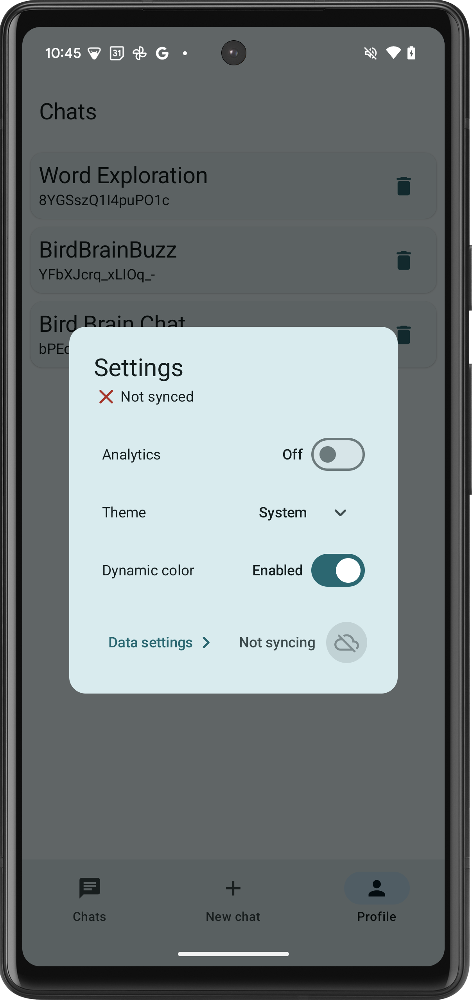

### Dynamic Dark Theme

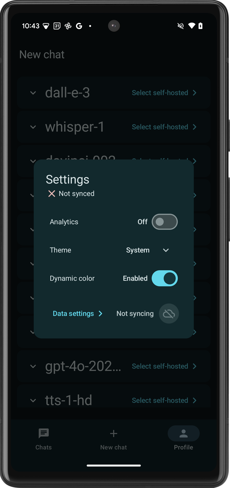
